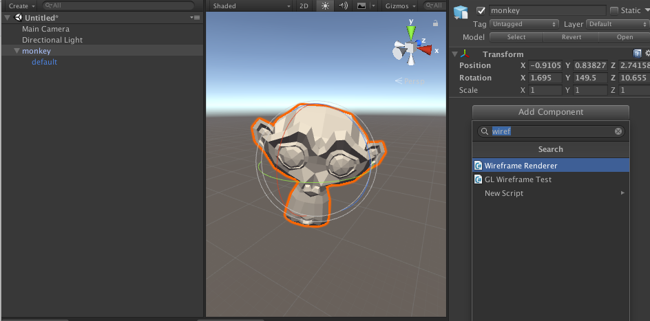

# UnityWireframeRenderer
Get a beautiful cross-platform wireframe renderer for your models in just one click

## Features
+ Supports `MeshRenderer` and `SkinnedMeshRenderer`
+ Customize line color and size
+ Option to show back faces (culling on/off)
+ Shaded mode
+ Doesn't require geometry shader, works on Android/iOS/Webgl 
+ Add the `WireframeRenderer` component in Editor mode for zero runtime setup costs

## Instructions
+ Import the `packages/UnityWireframeRenderer.package`
+ Add the `WireFrameRenderer` component to any Game Object with a (Skinned)MeshRenderer inside it.

