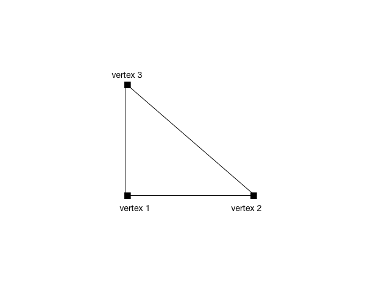
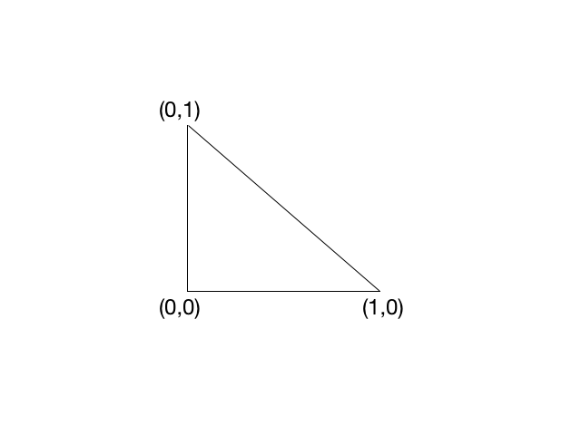
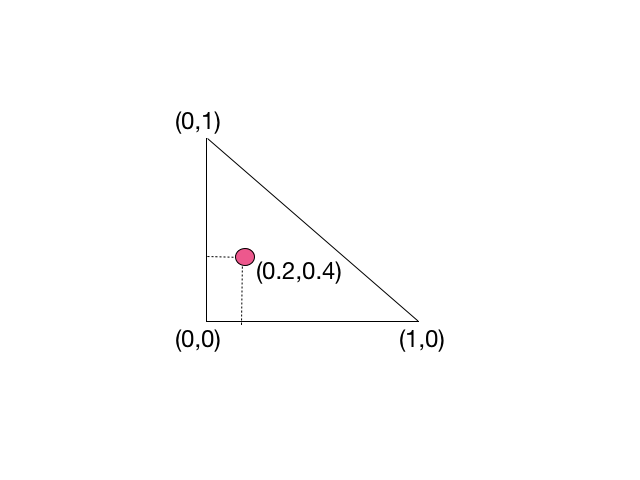
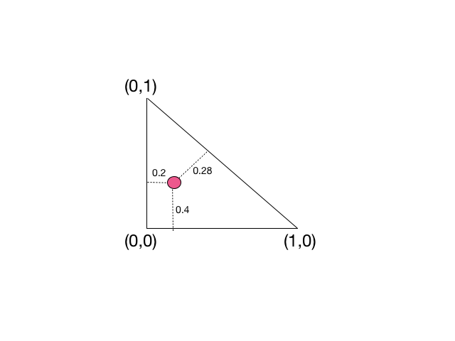
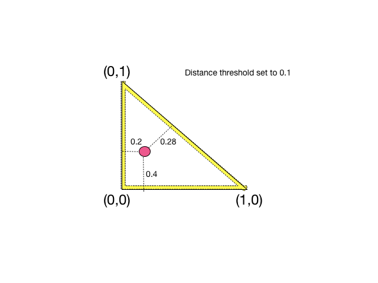
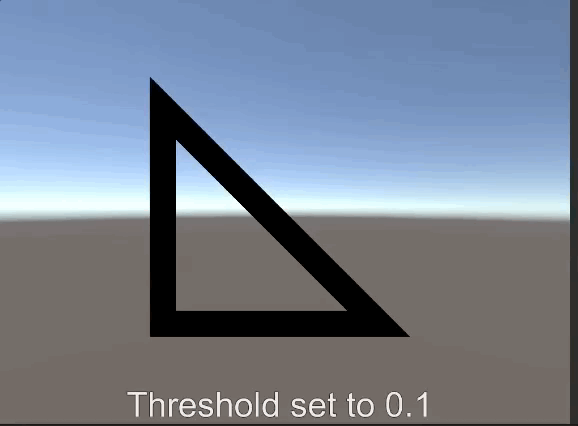
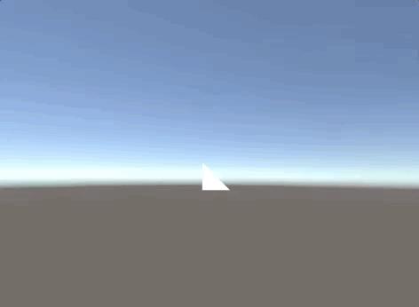
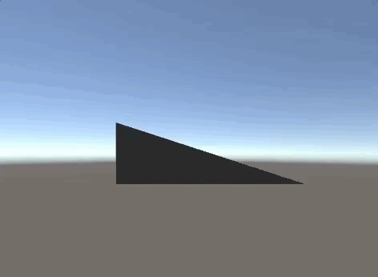

# UnityWireframeRenderer
Get a beautiful cross-platform wireframe renderer for your meshes in just one click

## Features
+ Supports `MeshRenderer` and `SkinnedMeshRenderer`
+ Customize line color and size
+ Option to show back faces (culling on/off)
+ Shaded mode
+ Doesn't require geometry shader, works on Android/iOS/Webgl 
+ Add the `WireframeRenderer` component in Editor mode for zero runtime setup costs

## Instructions
+ Import the `packages/UnityWireframeRenderer.package`
+ Add the `WireFrameRenderer` component to any Game Object with a (Skinned)MeshRenderer inside it.

## Implementation

Every mesh is made out of triangles. This is what a triangle looks like:

The objective of a wireframe is show the underlying shape (edges) of a mesh, so we need a fragment shader that only "paints" a fragment if it is near one of the edges. We can use the vertices uv to create a space that makes it easier to calculate these distances.

 

For every fragment, we will have access to the interpolated value of the uv coordinates defined for each of the vertices

Knowing this, it's easy to get the distances to all of the edges

With these distances, the fragment shader just needs to decide whether or not to "fill" the actual fragment. If the minimum edge distance is greater than some threshold, the resulting color is fully opaque, otherwise it is fully transparent.

If we set the threshold to 0.1, then the previous point would be considered to be too far away from any edge to be filled in.

Here is a little gif showing different thresholds in action:

This works nicely but it has one big drawback. Since we are working in UV space, the same threshold will result in different line sizes depending on the triangle screen-space size.

The image above depicts a case where two triangles have the same threshold but the one in the right has a line with half the size.

To fix this, we need to think in pixel space, and convert it back to uv space.

To achieve that, we need to resort to shader derivatives. These derivatives tell us the rate of change for a given value between two neighbouring fragments.

The following image shows the derivative for the u value in the x direction

A color closer to white means an higher rate of change, while a darker color represents the opposite. As you can see, the derivative is the same for all fragments inside the triangle. As the triangle gets bigger (occupies more screen space), the u value changes ever more slowly between each individual fragment.

If we change the scale in the y axis only, notice how the u derivative remains the same

### More will come soon...

